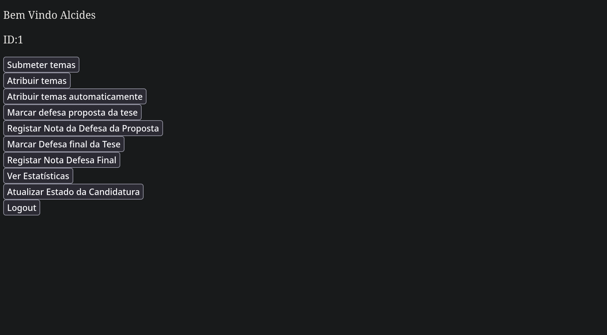
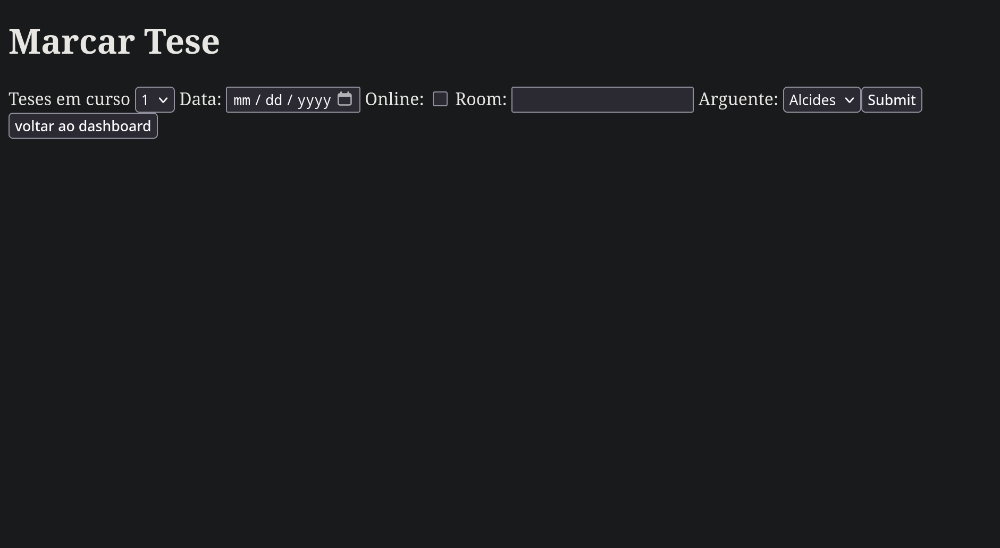
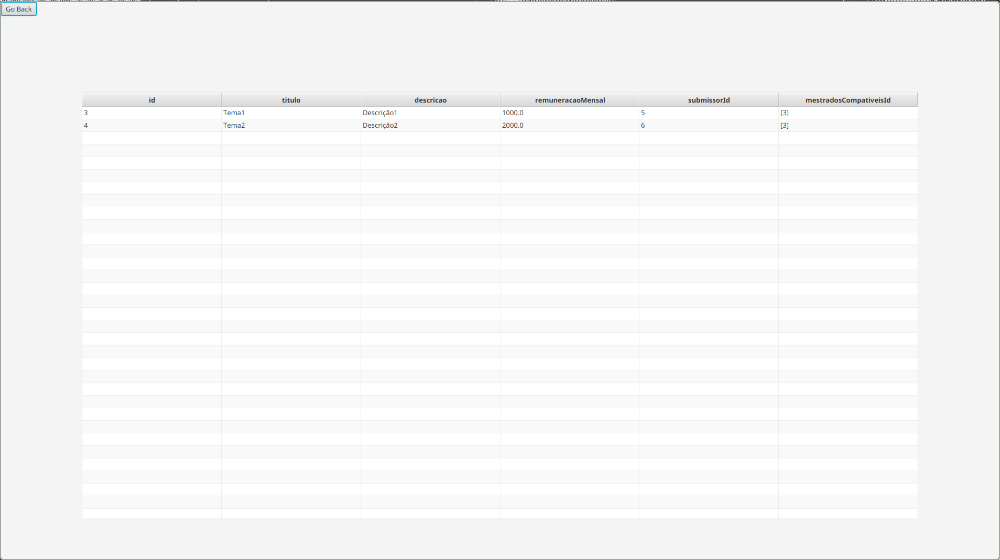

# Thesisman

## Grupo

- Daniela Camarinha fc58199
- Gonçalo Pinto fc58178
- José Brás fc55449 

## About

This platform simplifies managing master’s theses. Students register topics, submit proposals, and schedule defenses, while supervisors assign topics and evaluate work. It features a `web app` for supervisors and a `JavaFX app` for students, using Spring for REST and ORM. 

This project applies `object-oriented principles` and `ORM standards` to map object-oriented relationships into relational database structures. We utilized the `Spring framework` to manage ORM and develop `RESTful services`, among other functionalities.

<div style="margin-top: 60px;">
     
     
</div>

## Technologies Used

- **Backend**: Java with Spring Boot
- **Desktop App**: JavaFx
- **Database**: SQL
- **Build Tool**: Maven

## Installation

1. Clone the repository:
    ```sh
   git clone https://github.com/your-repo/Thesisman.git
    ```

2. Build the project
    ```sh
   docker compose up --build
    ```

3. Open the web application running on `http://localhost:8080/`

4. Open the Desktop App
    ```sh
   cd desktop-app && mvn clean javafx:run
    ```